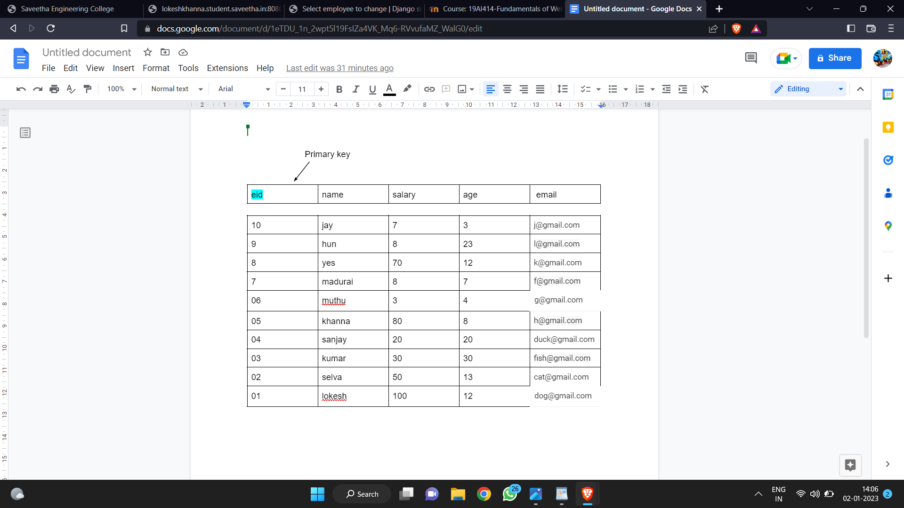
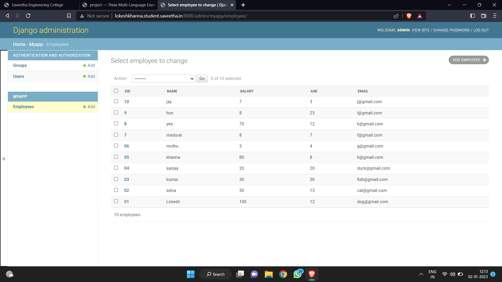

# Django ORM Web Application

## AIM
To develop a Django application to store and retrieve data from a database using Object Relational Mapping(ORM).

## ENTITY RELATIONSHIP DIAGRAM

## DESIGN STEPS

### STEP 1: 
Create a git clone "ORM"

### STEP 2:
 Add user name,user email in the git

### STEP 3:
 Make migration and run the server

## OUTPUT

## RESULT
 the program has been sucessfully executed.